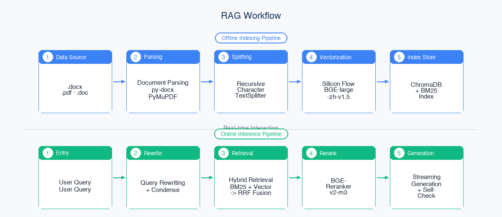
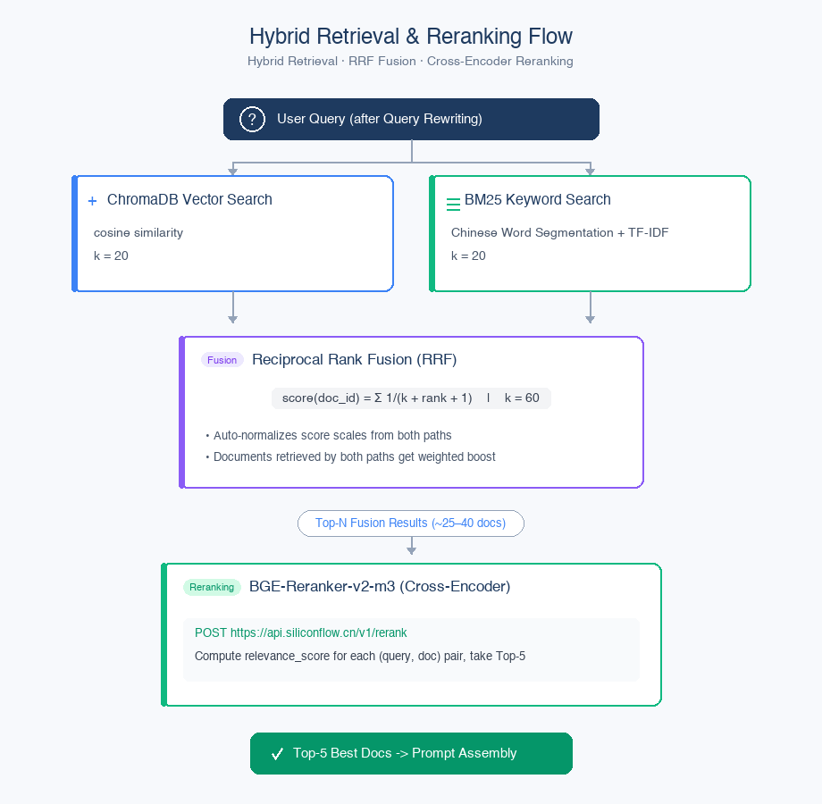

# PHDS-RAG

<p align="center">
  
  
  
  
  
  
</p>

<p align="center">
  <strong>Business Wiki RAG intelligent Q&A system</strong><br>
  Zero GPU cost · Hybrid retrieval · Multi-turn memory · Self-check · Knowledge base management
</p>

<p align="center">
  <strong>English</strong> · <a href="./README.zh.md">中文</a>
</p>

---

## RAG Architecture Design

### Overall Architecture

This system uses an enhanced RAG architecture with **Hybrid Retrieval + Reranker**, split into two pipelines: **offline indexing** and **online inference**:




| Layer | Responsibility | Technology | Design rationale |
|-------|----------------|------------|------------------|
| **Document parsing** | Extract raw text | python-docx, PyMuPDF (fitz), email + BeautifulSoup | PyMuPDF replaces PyPDF2 to improve Chinese PDF parsing quality; table structure is preserved |
| **Chunking** | Text segmentation | LangChain `RecursiveCharacterTextSplitter` | chunk_size=500, overlap=40, Chinese separators first |
| **Unified config** | Centralize all tunable parameters | `config.py` | Change once, apply globally; evaluation records parameter snapshots automatically |
| **Embedding** | Text → dense vector | SiliconFlow `BAAI/bge-large-zh-v1.5` | 1024 dimensions, optimized for Chinese, zero GPU via API |
| **Vector storage** | Vector index + BM25 | ChromaDB (HNSW) + rank-bm25 | Local persistence, cosine similarity, BM25 keyword complement |
| **Hybrid retrieval** | Dual recall + RRF fusion | BM25 + vector retrieval → Reciprocal Rank Fusion | Semantic and keyword matching complement each other, improving domain-term recall |
| **Reranking** | Cross-Encoder fine ranking | SiliconFlow `BAAI/bge-reranker-v2-m3` | Pairwise semantic relevance; Top-40 candidates → threshold filter → Top-5 |
| **Query rewriting** | Query optimization | DeepSeek deepseek-chat | Expand abbreviations, colloquial → formal terms, improve retrieval hit rate |
| **Multi-turn memory** | Dialogue context + summarization | DeepSeek deepseek-chat | Summary + last 6 messages compressed; auto-merge summary after 8 messages |
| **Generation** | Answer synthesis | DeepSeek `deepseek-chat` | temp=0.1, max_tokens=2000, streaming output + SSE |
| **Self-Check** | Fact verification | DeepSeek deepseek-chat (LLM-as-Judge) | Verify every fact has source support; score < 0.8 triggers conservative refusal |

### Chunk Design

#### Chunking Strategy

Uses `RecursiveCharacterTextSplitter`, which splits recursively by separator priority:

```python
RecursiveCharacterTextSplitter(
    chunk_size=500,
    chunk_overlap=40,
    separators=["\n\n", "\n", "。", "；", "，", " ", ""],
)
```

#### Chunk Metadata

```python
{
    "text": "会员品单价 = 会员类订单的销售金额 / 来客数...",
    "metadata": {
        "source": "./wiki_docs/客单价.pdf",
        "title": "客单价",
        "chunk_index": 3,
        "total_chunks": 24,
    }
}
```

### Hybrid Retrieval Design

#### Retrieval Flow



#### RRF Fusion Principle

```
RRF_score(d) = Σ 1 / (k + rank_r(d) + 1)  for each r ∈ R
```

- $R$: the set of all retrieval result lists
- $\text{rank}_r(d)$: the rank of document $d$ in result list $r$ (0-based)
- $k = 60$: smoothing parameter to prevent extreme rank differences

Advantages of RRF:
- No need to normalize the scores of the two retrieval paths (BM25 scores and cosine distances have completely different scales)
- Documents hit by multiple paths automatically receive higher weight
- Extensible to any number of retrieval paths

### Reranker Design

| Dimension | Choice | Notes |
|-----------|--------|-------|
| **Model** | BAAI/bge-reranker-v2-m3 | Top-tier Cross-Encoder on the MTEB leaderboard; multilingual and multi-granularity |
| **API** | SiliconFlow `/v1/rerank` | Simple to call, ~200-400ms latency |
| **Input** | (query, document) pairs | Each pair's semantic relevance is computed independently |
| **Output** | relevance_score (0-1) | Scored per pair, sorted descending |
| **Top-N** | 5 | Select the best 5 from ~40-80 candidate documents |
| **Threshold** | RERANK_THRESHOLD=0 | Chunks below this relevance_score are discarded; 0 disables it |

### Query Rewriting Design

```
Original question: "What's in the card area？"
     │
     ▼ (LLM)
Rewritten query: "The items in the card area and their definitions？"
```

```python
QUERY_REWRITE_PROMPT = """You are a query optimization assistant. The user's ambiguous question is rewritten into a more precise retrieval query。

规则：
1. Complete abbreviations and technical terms (e.g. "ratio "→" ratio/ratio difference")
2. Turn colloquial expressions into formal terms
3. If the question is accurate, go back to the original question
4. Output only the rewritten question without explanation. """
```

Rewriting rules:
- **Expand abbreviations**: `"Ratio "' → '" ratio/ratio difference"`
- **Normalize terminology**: `"How to calculate the customer unit price? "' → '" What is the formula for calculating the customer unit price"`
- **Disambiguate**: `"The index ranking "' → '" inventory turnover index store ranking rule"`
- Similarity check: if the rewritten query is almost identical to the original, keep the original to avoid over-rewriting

### Multi-turn Memory Design

#### Condense (On-the-fly Compression)

```
Conversation history:
  User: What are the types of guest unit price？
  Assistant: The unit price includes the unit price of member products, the unit price of non-member products and the unit price of overall products...
  User: How do they compare month-on-month？
  
   ↓ (summary: "Unit price type and month-on-month comparison calculation of user concern products")

Standalone question: "What is the month-on-month calculation method for the unit price of member products, non-member products and overall products？"
```

```python
CONDENSE_PROMPT = """Based on the dialogue summary and history, the user's most recent question is rewritten into independent questions。"""
```

- Uses "summary + last 6 uncompressed messages" as the compression context
- Replaces pronouns with concrete entities and completes omitted conditions from history

#### Persistent Summary (Long-conversation Memory)

```
Very long conversation (>8 unsummarized messages)
  │
  ▼ (LLM)
[Auto summary merge] old summary + new messages → new summary
  │
  ▼
Stored in the MySQL conversations table (summary | summarized_until_message_id)
```

- Threshold: automatically triggered after 8 unsummarized messages accumulate
- Summary content: business entities, formulas/numbers, filter conditions, unresolved questions
- Original messages are never deleted; summaries are only used for condense context-window control

### Self-Check Fact Verification Design

```
After generation → LLM verifies fact by fact → score 0.0-1.0
                                  │
                  ┌───────────────┼───────────────┐
                  ▼               ▼               ▼
             score ≥ 0.8    0.4 ≤ score < 0.8    score < 0.4
             returned      insufficient info    suspicious content
```

```python
SELF_CHECK_PROMPT = """You're a fact checker. Determine the key data, formulas, rules in the following AI answers
Whether all can find the original text support in the retrieval context.

评分标准：
-1.0: All key facts are clear in the context
-0.8-0.9: Most facts supported, few reasonable inferences
-0.4-0.7: Some facts are not supported
-0.0-0.3: heavy fabrication or context conflict """
```

Threshold policy:
- **score ≥ 0.8**: pass, return the answer normally
- **score < 0.8**: refuse, return `"Sorry, there is not enough information to confirm the exact answer to this question. There is not enough evidence in the existing documents to answer your question. Please refer to the original documents or contact relevant colleagues for confirmation。"`

### Embedding Design

| Dimension | Choice | Notes |
|-----------|--------|-------|
| **Model** | BAAI/bge-large-zh-v1.5 | Top-3 on the C-MTEB Chinese leaderboard |
| **Vector dimensions** | 1024 | Strong semantic discrimination from high-dimensional vectors |
| **API** | SiliconFlow | Low domestic latency (~50ms/chunk) |
| **Normalization** | Normalized | Works with cosine similarity |

### Document Parsing Design

| Format | Parser | Special handling |
|--------|--------|------------------|
| `.docx` | python-docx | Body paragraphs + table rows concatenated (`cell1 \| cell2 \| cell3`), preserving business data structure |
| `.pdf` | **PyMuPDF (fitz)** | Page-by-page extraction, blank-page filtering, double-newline joins between pages. Replaces PyPDF2 to improve Chinese PDF parsing quality |
| `.doc` (MIME) | email + BeautifulSoup | Legacy Word MIME HTML wrapper; parses the `text/html` part and extracts plain text |


---

## Features

- **Hybrid retrieval** — BM25 + vector dual recall → RRF fusion → Cross-Encoder fine ranking, reaching a 93.33% Hit Rate!
- **Query rewriting** — LLM automatically converts vague, colloquial questions into precise retrieval queries
- **Multi-turn condense** — Dialogue context compression for follow-up questions
- **Multi-turn memory** — Persistent session summaries auto-merge after 8 messages, so long conversations never lose context
- **Self-Check** — LLM-as-Judge fact verification with conservative refusal on low confidence
- **Vision recognition** — Upload screenshots/images; the SiliconFlow Qwen3-VL vision model extracts text and data to assist RAG Q&A
- **Streaming output** — SSE protocol, token-by-token rendering, first-token latency < 2s
- **Knowledge base management UI** — Upload, delete, list, and rebuild the index in one click, no command line needed
- **Traceable sources** — Every answer includes the Top-5 retrieved snippets (with rerank_score)

---

## Quick Start

### Requirements

- Python 3.11+
- MySQL 8.0+
- [SiliconFlow API Key](https://siliconflow.cn) (Embedding + Reranker)
- [DeepSeek API Key](https://platform.deepseek.com) (LLM)
- SMTP email account (e.g. 163, with SMTP authorization code enabled)

### 1. Install Dependencies

```bash
conda create -n PHDS_RAG python=3.11 -y
conda activate PHDS_RAG
pip install -r requirements.txt
```

### 2. Configure Environment Variables

```bash
cp .env.example .env
```

| Variable | Description | Example |
|----------|-------------|---------|
| `DEEPSEEK_API_KEY` | DeepSeek API key | `sk-xxx` |
| `SILICONFLOW_API_KEY` | SiliconFlow API key (Embedding + Reranker) | `sk-xxx` |
| `EMBEDDING_MODEL` | Embedding model | `BAAI/bge-large-zh-v1.5` |
| `LLM_MODEL` | Generation model | `deepseek-chat` |
| `CHUNK_SIZE` | Chunk size | `500` |
| `CHUNK_OVERLAP` | Chunk overlap | `40` |
| `DB_PASS` | MySQL password | |
| `SMTP_HOST` / `SMTP_PORT` / `SMTP_USER` / `SMTP_PASS` / `SMTP_FROM` | SMTP settings | `smtp.163.com:465` |

### 3. Initialize the Database

Tables are created automatically on first startup; you can also create them manually:

```sql
CREATE DATABASE IF NOT EXISTS company_rag
  DEFAULT CHARSET utf8mb4 COLLATE utf8mb4_unicode_ci;
```

### 4. Build the Knowledge Base

**Option 1: Web UI upload (recommended)**

After starting the service, visit `/kb` to upload .pdf / .docx / .doc files and click "Rebuild index".

**Option 2: Command line**

Place documents in the `wiki_docs/` directory:

```bash
python build_index.py
```

### 5. Start the Service

```bash
python app.py
```
---

## Project Structure

```
company-rag/
├── app.py                  # FastAPI main service: auth middleware + all API routes
├── auth.py                 # Email verification code sending + session lifecycle management
├── database.py             # MySQL connection pool + auto-creation of 5 tables
├── config.py               # Unified parameter management: all tunable parameters in one place
├── build_index.py          # Command-line offline index building (parse → chunk → embed → store)
├── kb_manager.py           # Knowledge base management: document CRUD + index rebuild
├── document_loader.py      # Document parsing: docx (with tables) / pdf (PyMuPDF) / MIME HTML
├── chunker.py              # RecursiveCharacterTextSplitter chunking strategy
├── embeddings.py           # SiliconFlow BGE-large-zh-v1.5 embedding configuration
├── vector_store.py         # ChromaDB vector store + BM25Retriever + index persistence
├── rag_chain.py            # Core RAG pipeline: vision → query rewrite → condense → hybrid retrieval → reranker → generation → self-check
├── evaluate.py             # RAG evaluation: Hit Rate/MRR/Recall/NDCG/Faithfulness/Relevancy
├── requirements.txt
├── .env.example
├── .gitignore
├── static/
│   ├── chat.html           # ChatGPT-style SPA Q&A frontend
│   └── kb.html             # Knowledge base management UI (upload/delete/rebuild)
├── wiki_docs/              # Knowledge base source documents (gitignored)
├── chroma_db/              # ChromaDB vector data (gitignored)
└── bm25_index.pkl          # BM25 sparse index (gitignored)
```

---

## License

MIT
