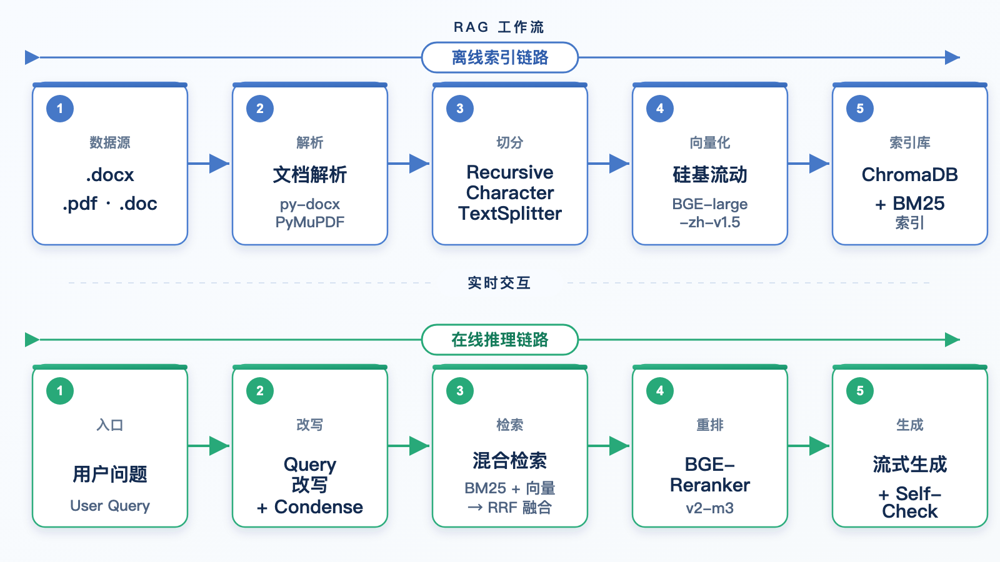
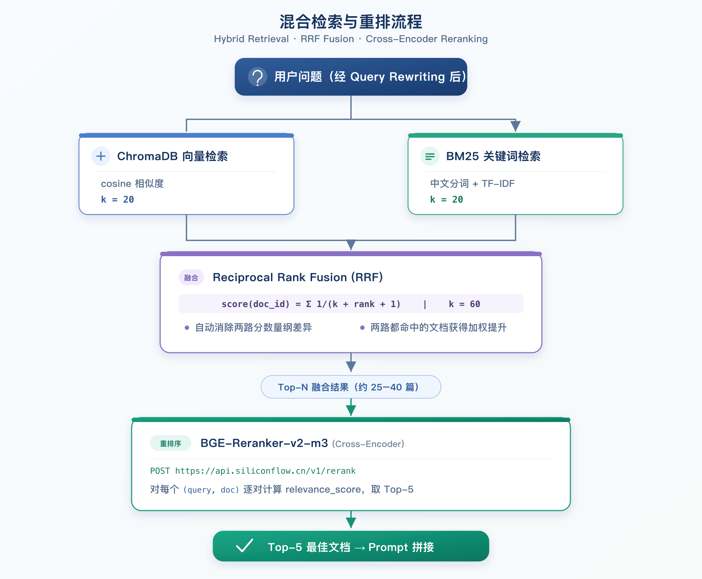

# PHDS-RAG

<p align="center">
  
  
  
  
  
  
</p>

<p align="center">
  <strong>业务 Wiki RAG 智能问答系统</strong><br>
  零 GPU成本 · 混合检索 · 多轮记忆 · 自我检查 · 知识库管理
</p>

---

## RAG 技术架构设计

### 整体架构

本系统采用**混合检索 + 重排序（Hybrid Retrieval + Reranker）** 的增强型 RAG 架构，分为**离线索引**和**在线推理**两条链路：




| 层级 | 职责 | 技术选型 | 设计决策 |
|------|------|----------|----------|
| **文档解析** | 提取原始文本 | python-docx、PyMuPDF (fitz)、email+BeautifulSoup | PyMuPDF 替代 PyPDF2 提升中文 PDF 解析质量；保留表格结构 |
| **Chunk 切分** | 文本分段 | LangChain `RecursiveCharacterTextSplitter` | chunk_size=500、overlap=40、中文分隔符优先 |
| **统一调参** | 所有可调参数集中管理 | `config.py` | 修改一处、全局生效，评测自动记录参数快照 |
| **向量化** | 文本 → 稠密向量 | 硅基流动 `BAAI/bge-large-zh-v1.5` | 1024 维、中文优化、API 调用零 GPU |
| **向量存储** | 向量索引 + BM25 | ChromaDB (HNSW) + rank-bm25 | 本地持久化、cosine 相似度、BM25 关键词互补 |
| **混合检索** | 双路召回 + RRF 融合 | BM25 + 向量检索 → Reciprocal Rank Fusion | 语义匹配与关键词匹配互补，提升专业术语召回 |
| **重排序** | Cross-Encoder 精排 | 硅基流动 `BAAI/bge-reranker-v2-m3` | 逐对计算语义相关性，Top-40 候选 → 阈值过滤 → Top-5 |
| **Query 改写** | 查询优化 | DeepSeek deepseek-chat | 补全缩写、口语化→正式术语，提升检索命中率 |
| **多轮记忆** | 对话上下文 + 摘要 | DeepSeek deepseek-chat | 摘要 + 最近 6 条消息联合压缩；超 8 条自动触发摘要合并 |
| **生成** | 答案合成 | DeepSeek `deepseek-chat` | temp=0.1、max_tokens=2000、流式输出 + SSE |
| **Self-Check** | 事实自检 | DeepSeek deepseek-chat (LLM-as-Judge) | 核查回答每条事实是否有原文依据，score < 0.8 触发保守拒答 |

### Chunk 设计

#### 分块策略

采用 `RecursiveCharacterTextSplitter`，按分隔符优先级递归切分：

```python
RecursiveCharacterTextSplitter(
    chunk_size=500,
    chunk_overlap=40,
    separators=["\n\n", "\n", "。", "；", "，", " ", ""],
)
```

#### Chunk 元数据

```python
{
    "text": "会员品单价 = 会员类订单的销售金额 / 来客数...",
    "metadata": {
        "source": "./wiki_docs/客单价.pdf",
        "title": "客单价",
        "chunk_index": 3,
        "total_chunks": 24,
    }
}
```

### 混合检索设计

#### 检索流程



#### RRF 融合原理

```
RRF_score(d) = Σ 1 / (k + rank_r(d) + 1)  for each r ∈ R
```

- $R$：所有检索结果列表的集合
- $\text{rank}_r(d)$：文档 $d$ 在结果列表 $r$ 中的排名（从 0 开始）
- $k = 60$：平滑参数，防止极端排名差异

RRF 的优势：
- 无需归一化两路检索的分数（BM25 分数和 cosine 距离量纲完全不同）
- 多路共同命中自动获得更高权重
- 对任意路数均可扩展

### Reranker 设计

| 维度 | 选择 | 说明 |
|------|------|------|
| **模型** | BAAI/bge-reranker-v2-m3 | MTEB 榜单 Top 级 Cross-Encoder，多语言多粒度 |
| **API** | 硅基流动 `/v1/rerank` | 调用简单，延迟 ~200-400ms |
| **输入** | (query, document) 对 | 每对独立计算语义相关性 |
| **输出** | relevance_score (0-1) | 逐对打分，降序排列 |
| **Top-N** | 5 | 从 ~40-80 个候选文档中精选最优 5 个 |
| **阈值** | RERANK_THRESHOLD=0 | relevance_score 低于此值的 chunk 丢弃，0 表示禁用 |

### Query 改写设计

```
原始问题: "卡片区有哪些内容？"
     │
     ▼ (LLM)
改写结果: "卡片区包含哪些指标项及其定义？"
```

```python
QUERY_REWRITE_PROMPT = """你是一个查询优化助手。将用户的模糊问题改写为更精确的检索查询。

规则：
1. 补全缩写和专业术语（如"环比"→"环比率/环比差值"）
2. 将口语化表达转为正式术语
3. 如果问题本身已经很精确，直接返回原问题
4. 只输出改写后的问题，不要任何解释"""
```

改写规则：
- **补全缩写**：`"环比"` → `"环比率/环比差值"`
- **术语正规化**：`"客单价怎么算"` → `"客单价的计算公式是什么"`
- **消除歧义**：`"那个指标的排名"` → `"库存周转指标的门店排名规则"`
- 改写前后的相似性判断：若改写结果与原问题几乎相同，保留原问题以避免过度改写

### 多轮记忆设计

#### Condense（即时压缩）

```
历史对话:
  用户: 客单价有哪些类型？
  助手: 客单价包含会员品单价、非会员品单价、整体品单价...
  用户: 它们的环比怎么看？
  
   ↓ （摘要: "用户关注品单价类型及环比计算"）

独立问题: "会员品单价、非会员品单价、整体品单价的环比计算方法是什么？"
```

```python
CONDENSE_PROMPT = """根据对话摘要和历史，将用户的最新问题改写为独立问题。"""
```

- 取「摘要 + 最近 6 条未压缩消息」作为压缩上下文
- 将代词替换为具体实体，省略条件从历史中补全

#### 持久化摘要（长对话记忆）

```
超长对话 (>8 条未摘要消息)
  │
  ▼ (LLM)
【自动触发摘要合并】旧摘要 + 新消息 → 新摘要
  │
  ▼
存入 MySQL conversations 表（summary | summarized_until_message_id）
```

- 阈值：累计 8 条未摘要消息自动触发
- 摘要内容：业务对象、公式/数字、筛选条件、未解决问题
- 永不删除原始消息，摘要只用于 condense 上下文窗口控制

### Self-Check 事实自检设计

```
生成回答后 → 调用 LLM 逐条核查 → 打分 0.0-1.0
                                  │
                  ┌───────────────┼───────────────┐
                  ▼               ▼               ▼
             score ≥ 0.8    0.4 ≤ score < 0.8    score < 0.4
             正常返回         资料不足         可疑内容
```

```python
SELF_CHECK_PROMPT = """你是一个事实核查员。判断以下 AI 回答中的关键数据、公式、规则
是否都能在检索上下文中找到原文支持。

评分标准：
- 1.0: 所有关键事实在上下文中有明确原文
- 0.8-0.9: 大部分事实有依据，少量合理推断
- 0.4-0.7: 部分事实缺乏依据
- 0.0-0.3: 大量编造或与上下文冲突"""
```

阈值策略：
- **score ≥ 0.8**：通过，正常返回回答
- **score < 0.8**：拒绝，返回 `"抱歉，资料不足，我无法确认该问题的准确答案。现有文档中没有找到足够的依据来回答您的问题，建议查阅原始文档或联系相关同事确认。"`

### Embedding 设计

| 维度 | 选择 | 说明 |
|------|------|------|
| **模型** | BAAI/bge-large-zh-v1.5 | C-MTEB 中文榜单 Top-3 |
| **向量维度** | 1024 | 高维向量强语义区分能力 |
| **API** | 硅基流动 | 国内低延迟（~50ms/chunk） |
| **归一化** | 已归一化 | 配合 cosine 相似度 |

### 文档解析设计

| 格式 | 解析器 | 特殊处理 |
|------|--------|----------|
| `.docx` | python-docx | 正文段落 + 表格逐行拼接（`cell1 \| cell2 \| cell3`），保留业务数据结构 |
| `.pdf` | **PyMuPDF (fitz)** | 逐页提取、空页过滤、页间双换行拼接。替换 PyPDF2 以提升中文 PDF 解析质量 |
| `.doc` (MIME) | email + BeautifulSoup | 旧版 Word MIME HTML 封装，解析 `text/html` 部分后提取纯文本 |


---

## 功能特性

- **混合检索** — BM25 + 向量双路召回 → RRF 融合 → Cross-Encoder 精排,HitRate达到93.33%!
- **Query 改写** — LLM 自动将模糊口语化问题转为精确检索查询
- **多轮 Condense** — 对话上下文压缩，支持多轮追问
- **多轮记忆** — 持久化会话摘要，超 8 条消息自动合并，长对话不丢上下文
- **Self-Check** — LLM-as-Judge 事实自检，低置信度自动保守拒答
- **视觉识别** — 支持上传截图/图片，硅基流动 Qwen3-VL 视觉模型提取图中文字数据，辅助 RAG 问答
- **流式输出** — SSE 协议，逐字渲染，首 token 可见时间 < 2s
- **知识库管理 UI** — 文档上传、删除、列表查看、一键重建索引，无需命令行
- **来源可追溯** — 每轮回答附带 Top-5 检索片段（含 rerank_score）

---

## 快速开始

### 环境要求

- Python 3.11+
- MySQL 8.0+
- [硅基流动 API Key](https://siliconflow.cn)（Embedding + Reranker）
- [DeepSeek API Key](https://platform.deepseek.com)（LLM）
- SMTP 邮箱（如 163，需开启 SMTP 授权码）

### 1. 安装依赖

```bash
conda create -n PHDS_RAG python=3.11 -y
conda activate PHDS_RAG
pip install -r requirements.txt
```

### 2. 配置环境变量

```bash
cp .env.example .env
```

| 变量 | 说明 | 示例 |
|------|------|------|
| `DEEPSEEK_API_KEY` | DeepSeek API 密钥 | `sk-xxx` |
| `SILICONFLOW_API_KEY` | 硅基流动 API 密钥（Embedding + Reranker） | `sk-xxx` |
| `EMBEDDING_MODEL` | Embedding 模型 | `BAAI/bge-large-zh-v1.5` |
| `LLM_MODEL` | 生成模型 | `deepseek-chat` |
| `CHUNK_SIZE` | 分块大小 | `500` |
| `CHUNK_OVERLAP` | 分块重叠 | `40` |
| `DB_PASS` | MySQL 密码 | |
| `SMTP_HOST` / `SMTP_PORT` / `SMTP_USER` / `SMTP_PASS` / `SMTP_FROM` | SMTP 配置 | `smtp.163.com:465` |

### 3. 初始化数据库

首次启动自动建表，也可手动：

```sql
CREATE DATABASE IF NOT EXISTS company_rag
  DEFAULT CHARSET utf8mb4 COLLATE utf8mb4_unicode_ci;
```

### 4. 构建知识库

**方式一：Web UI 上传**（推荐）

启动服务后访问 `/kb`，通过 Web 界面上传 .pdf / .docx / .doc 文件并点击「重建索引」。

**方式二：命令行**

将文档放入 `wiki_docs/` 目录：

```bash
python build_index.py
```

### 5. 启动服务

```bash
python app.py
```
---

## 项目结构

```
company-rag/
├── app.py                  # FastAPI 主服务：Auth 中间件 + 全部 API 路由
├── auth.py                 # 邮箱验证码发送 + Session 生命周期管理
├── database.py             # MySQL 连接池 + 5 张表自动建表
├── config.py               # 统一参数管理：所有可调参数集中配置
├── build_index.py          # 命令行离线索引构建（解析→分块→向量化→入库）
├── kb_manager.py           # 知识库管理：文档 CRUD + 索引重建
├── document_loader.py      # 文档解析：docx(含表格)/pdf(PyMuPDF)/MIME HTML
├── chunker.py              # RecursiveCharacterTextSplitter 分块策略
├── embeddings.py           # 硅基流动 BGE-large-zh-v1.5 Embedding 配置
├── vector_store.py         # ChromaDB 向量库 + BM25Retriever + 索引持久化
├── rag_chain.py            # RAG 核心管线：视觉识别→Query改写→Condense→混合检索→Reranker→生成→Self-Check
├── evaluate.py             # RAG 评估：Hit Rate/MRR/Recall/NDCG/Faithfulness/Relevancy
├── requirements.txt
├── .env.example
├── .gitignore
├── static/
│   ├── chat.html           # ChatGPT 风格 SPA 问答前端
│   └── kb.html             # 知识库管理界面（上传/删除/重建）
├── wiki_docs/              # 知识库源文档目录（gitignore）
├── chroma_db/              # ChromaDB 向量数据（gitignore）
└── bm25_index.pkl          # BM25 稀疏索引（gitignore）
```

---

## 开源协议

MIT
